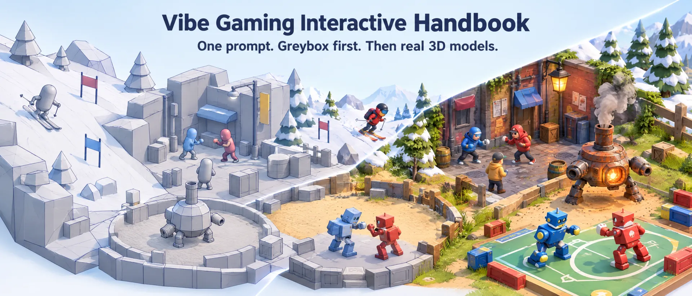
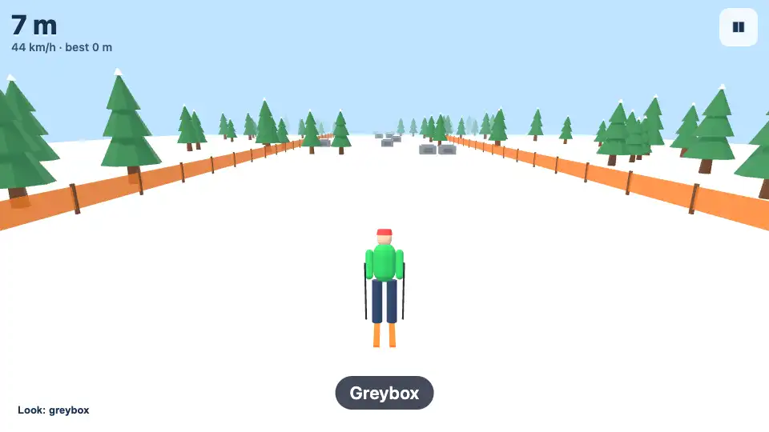
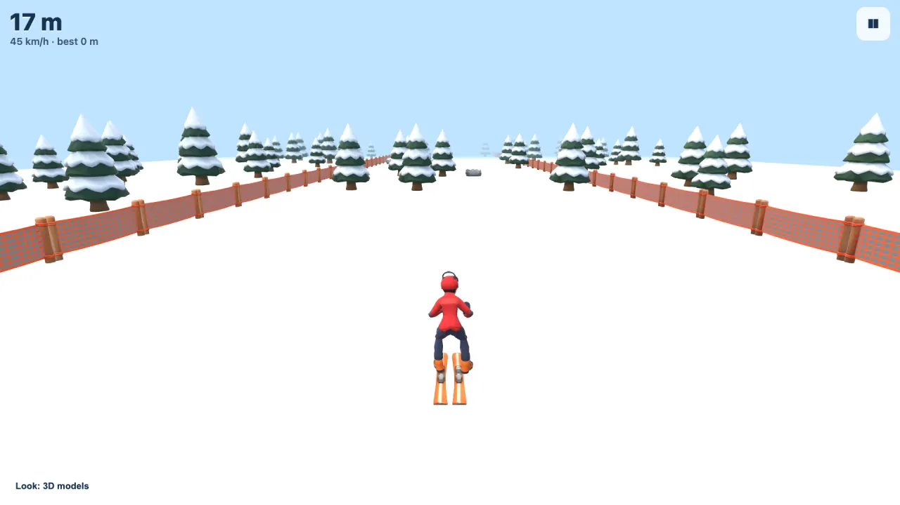
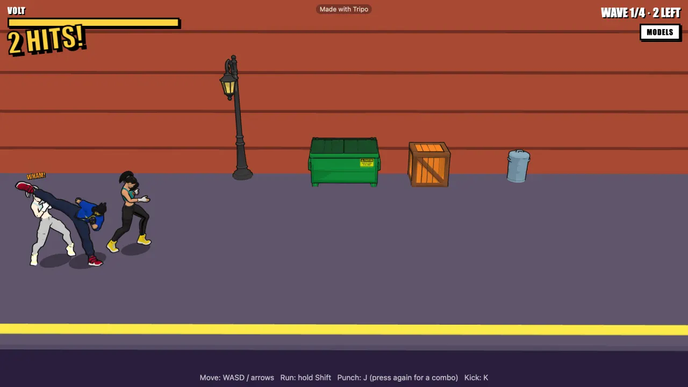
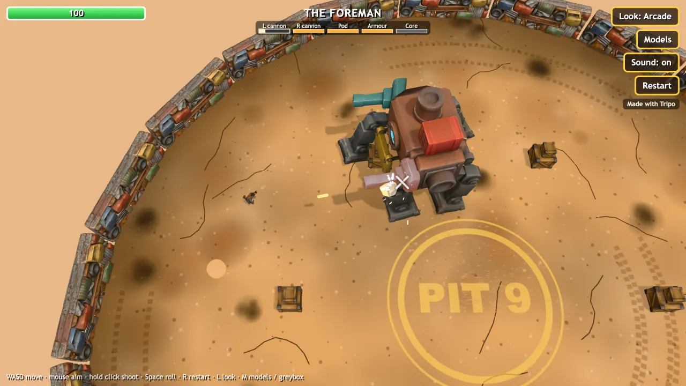
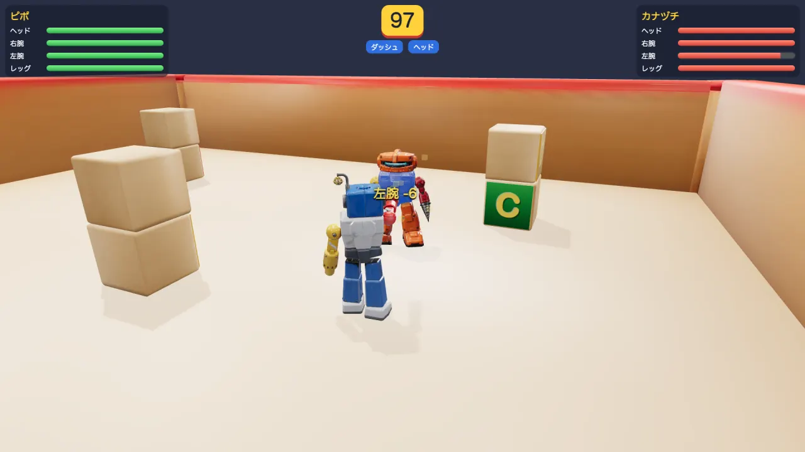
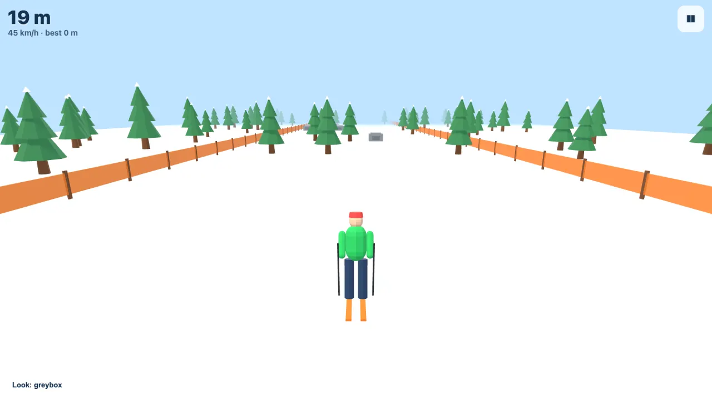
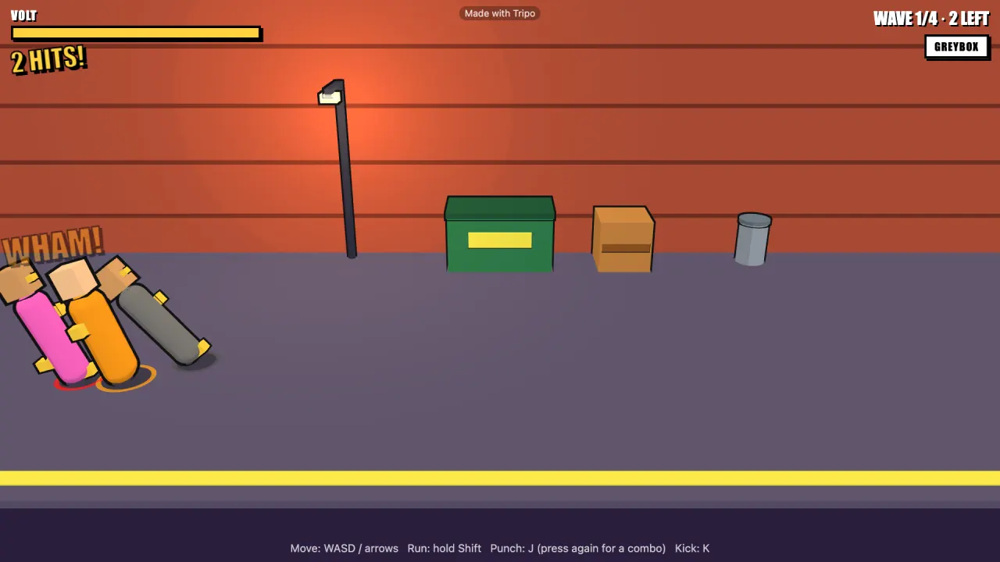
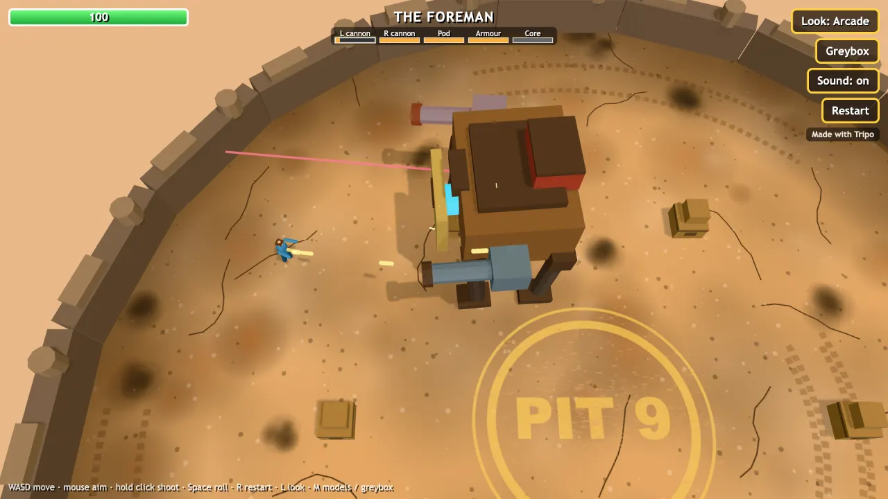
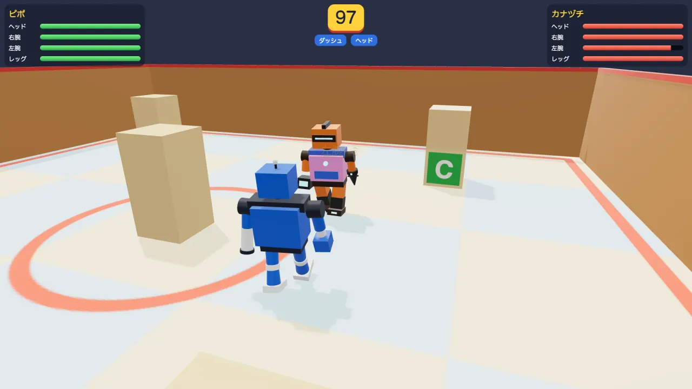

# Vibe Gaming インタラクティブ・ハンドブック

[](https://github.com/TripoGrowthLab/vibe-gaming-interactive-handbook/stargazers) [](prompt/vibe-gaming.md) [](LICENSE) [](https://github.com/TripoGrowthLab/vibe-gaming-interactive-handbook/actions/workflows/check.yml)

<p>
  <a href="README.md"></a>
  <a href="README.zh-CN.md"></a>
  <a href="README.ja.md"></a>
</p>

> まずはアイデアを探したい？ [Awesome 3D Prompts](https://github.com/TripoGrowthLab/awesome-3d-prompts) と [Awesome Opus 5.5 Prompts](https://github.com/TripoGrowthLab/awesome-opus-5-5-prompts) もどうぞ。

<a href="https://studio.tripo3d.ai/?utm_source=github&amp;utm_medium=referral&amp;utm_campaign=vibe_gaming_interactive_handbook&amp;utm_content=readme_ja_hero"></a>

**プロンプトひとつ、空のフォルダひとつで、シェアできる 3D ゲームを。**

コーディングエージェントにプロンプトをひとつ貼るだけ。エージェントがあなたと一緒に小さなブラウザゲームを設計し、まず遊べるグレーボックス版を作り、必要な 3D モデルを書き出し、あなたが Tripo Studio で作ったモデルに差し替えます。コードを書く必要はありません。あなたは遊んで、感想を伝えて、モデルを作るだけです。

**プロンプト 1 つ · 6 ステージ · サンプルゲーム 4 本 · 4 本とも人の介入 0 回**

[はじめに](#start-here) · [プロンプト](#the-prompt) · [サンプルゲーム](#example-games) · [モデルを用意する](#get-the-models) · [ディスカッション](https://github.com/TripoGrowthLab/vibe-gaming-interactive-handbook/discussions) · [更新履歴](prompt/CHANGELOG.md) · [Tripo Studio ↗](https://studio.tripo3d.ai/?utm_source=github&utm_medium=referral&utm_campaign=vibe_gaming_interactive_handbook&utm_content=readme_ja_nav)



*Star しておけば後で見つけやすくなります。プロンプトの新バージョンや新しいサンプルの通知を受け取るには **Watch → Custom → Releases** を選んでください。*

<a id="start-here"></a>

## はじめに

1. **プロンプトをコピー。** コーディングエージェント（Claude Code、Codex、Cursor など）で空のフォルダを開き、[プロンプト](#the-prompt)を貼り付けます。
2. **質問に答えて、グレーボックス版を遊ぶ。** エージェントが最大 5 つ質問し、1 ページの設計書を書き、シンプルな形だけでゲームを組み立てます。遊んでみて気になった点を伝えれば、直してテストし直します。
3. **モデルを作って差し替える。** エージェントが `assets.json` と、モデルごとの Tripo Studio の手順を書き出します。生成して GLB で書き出せば、エージェントがゲームに組み込み、ひとつずつグレーボックス版と見比べてチェックします。

先に完成形を見たいなら、このリポジトリをクローンして[サンプルゲーム](#example-games)を動かしてみてください。

<a id="the-prompt"></a>

## プロンプト

バージョン 1.0 · 2026-09-29 · 英語で約 2,600 語。下のコードブロックをコピーするか（右上にコピーボタンがあります）、[`prompt/vibe-gaming.md`](prompt/vibe-gaming.md) で読めます。プロンプトは英語ですが、そのままエージェントに渡して大丈夫です。

<details>
<summary><strong>プロンプトを表示</strong></summary>

<!-- prompt:start -->
```text
Help me make a small 3D browser game, step by step. I have never made a game before.

Before you write any code, ask me up to 5 short questions in one message: what the game is about, the one thing the player does, keyboard or phone or both, the art style, and anything I already have. Wait for my answers.

Then work in stages. Stop at the end of every stage, tell me how to try it, and wait for my feedback:

1. Design — write GDD.md, one page: core loop, controls (keyboard and touch), win and lose, camera, and a table of every object on screen with an id, its size in metres and which way it faces. Keep it to one level and one core loop. Make up your own characters, names and level layout; do not copy any existing game, and do not make anything look like a well-known game character or item either. For every character that animates, list its states (for example idle, run, attack, hurt, knocked down) and when it switches between them, and say whether it is a person or another kind of body (an animal, a robot dog, a bug); only people get bones, so a body that is not a person is built from parts that move in code. If characters fight, write for each attack: which animation it uses, how much damage it does, and at what fraction of the animation the hit lands and ends. If a machine or object has parts that move, can be shot off or break apart, list its parts: what each part does, where it hinges, how much it can take, and what changes when it breaks. If parts can be swapped between machines or characters, give all of them the same set of slots, and for each slot write one attach point (where it sits, measured from the centre of the feet) and which way a part faces on that point.

2. Greybox — build it with Three.js and Vite, no game engine. Use only boxes, cylinders and capsules, sized from the table. Keep everything about how objects look in one place: a registry from id to a builder function, so a 3D model can replace any placeholder later without touching gameplay code. Build an object with parts as a group of named child placeholders, one per part, each turning around its own hinge, and let gameplay find parts by name. If parts can be swapped, hang each swappable part on a named attach point; swapping a part means hanging another part on that point and scaling it to fit the slot, and gameplay still finds parts by name. Every placeholder faces +Z. If the player jumps, make it feel good: a jump pressed just before landing still counts, a jump just after walking off a ledge still works, and holding the button jumps higher. If the player fights, make it feel good: a button pressed during an attack queues the next one, a hit freezes both fighters for a split second and pushes the target back, a character that was just hit cannot be hit again at once, and enemies take turns attacking instead of all at once. Show states on the placeholders (a colour or a lean) so I can see them. Moving characters must look smooth on both 60 Hz and 120 Hz screens. Done when I can play a full round and restart, on desktop and on a phone. If a later change adds a new state, add it to GDD.md and tell me which animation it needs.

3. Asset list — write assets.json with one entry per id: its kind (prop, person or parts), size in metres (height for people, longest edge for everything else), a polygon budget in triangles (at least 500), and one English image prompt. Give every prompt the same art-style sentence, describe the shape and proportions it must have to fit its size, and end it with "single isolated object, centered, on a plain white background". At most 8 entries; if several enemies share a shape, they share one entry, and one that differs only in colour gets a one-line texture prompt on that entry instead of a new entry.

   - A person that animates must stand in a T-pose, facing the camera, with its head no more than a third of its height, arms long enough to reach mid-thigh, a body no wider than its shoulders, space between the arms, legs and body, and nothing loose that would flap or stick out (scarves, long hair, bandana tails, capes). Give it a list of animations taken only from these names in the Tripo library: idle, walk, run, jump, jump_down, fall, box_01, box_02, box_03, front_kick_01, slash, shoot, hit_to_body_01, hit_to_head, defeat_02, cheer. The name is only a label, so pick by what the motion is: jump has a long crouch before take-off, jump_down is a drop through the air, fall is tripping over onto the ground, defeat_02 is being knocked down, and the attacks are much slower than a game needs.

      If no name fits, write a one-line description of the motion instead, starting with its name and a colon (for example "dodge: a small character rolls forward and gets back up"); this works for people only. Anything that only spins, bobs, squashes or flashes is animated in code, not in Tripo.

   - An object with parts (a machine, an animal or robot animal, anything that breaks apart) is one model that Tripo will split. List its parts in plain words (for example "left_cannon", "armour_plate", "front_left_leg"), at most 10, and if parts can be swapped, say which slot each part fits. Write the image prompt so that any central body is clearly its own piece, and every part in one main colour of its own, with a gap between parts. Parts that walk or swing are moved in code at their hinges, not rigged.

   - If I want a second look for the game (for example a style switch, or an elite enemy), give the entry up to 2 styles from Mecha Pop, classic, Wood, or "own image: [one line describing the look]" if I will make my own style picture and upload it; or "none".

   Add up the triangles and texture memory for the busiest moment on screen and say whether a phone can handle it; each Tripo model comes with only one colour texture at the chosen resolution (a split model shares it across its pieces) and no other maps.

4. My turn — write these steps once, exactly as written here; do not add or change steps, and do not try to generate the models yourself. Then give me one table with a row per entry: id, kind, prompt, polygon budget, file name, animations or parts, and style (or "none"):

   a. In Tripo Studio (studio.tripo3d.ai), open Image, paste the prompt and generate. Pick the image whose shape best matches the list.

   b. Hover over that image and click Generate 3D. It may open on the HD Model tab, so click the Smart Mesh tab and choose P2.0 (P1.0 if P2.0 is not on your plan), open Topology and check it says Triangle (not Quad) and Polycount = the budget every time, because it resets even though it says it saves your settings; Number of Generation 1. Generate. (For a soft, rounded person such as clay or plush, the HD Model tab with H3.1 can look better; everything else stays the same.) Parts only: do not use Smart Mesh; use the HD Model tab instead: pick H3.1, turn on Generate in Parts, choose Simple, open Geometry & Texture and set Topology to Triangle and Polycount = the budget. Every model: before you click Generate, change Privacy to Private (it starts as Sharing Only).

   c. Parts only: you will get several pieces, named tripo_part_N, not always one per part on the list. Open Fill Parts, choose AI Completion and click Part Completion to fill the gaps; the result is saved by itself.

   d. Open Texture, make sure Texture Resolution is 2K (it starts at 8K, then remembers your choice), and Generate Texture. If the entry has styles, export this default version first (step f; for a person, do step e first), then do this once for each style: pick it under Create Your Own Texture Style, Generate Texture again, and export it as the id plus the style name (for example robot_mechapop). To go back to no style, click the chosen style again in the style window. For a person, a new texture removes its animations: apply them again in Animate (this costs no credits) before you export. For an "own image" style: in Image, make a picture from its line, download it, and upload it under Create Your Own Texture Style.

   e. People only: open Rig, choose Humanoid and the Mixamo skeleton, click Auto Rig. Then open Animate, make sure All is selected, search each animation name from the list and click it to apply; wait until it finishes Retargeting before you click the next one. For a line that is a description, paste it into Text to Motion and generate (this one costs credits).

   f. Click Export: GLB, texture resolution 2k, file name = the id. For people, make sure Export Skeleton is on, click Number of Animations and choose Select All (it starts at 0, which exports no animations), then make sure Animation stay in Place is on. If you see Pack UV, make sure it is off.

   g. Put the files in public/assets/, replacing any old file with the same name.

   Wait until I say they are in.

5. Swap — load each GLB in place of its placeholder: scale it to the size in the list (people by height), sit it on the ground, and add an environment map so materials are not black. Render every model next to its placeholder and check it faces the same way; rotate it if it does not. First list what is really inside each file: animation names (Tripo often renames them: defeat_02 can come out as defeat_03, and a Text to Motion clip is named after the start of its description) and, for split models, every piece with its name, size and position. Match animations by the closest name. Match pieces by name first; pieces still called tripo_part_N belong to the part whose placeholder they overlap most, so group them in code. The sizes stored in the file are not reliable, so recompute each bounding box before you measure anything. The order of meshes changes from file to file, so always match pieces by node name. Tell me what you matched and what is missing. Every piece keeps the whole model's origin: move each part's pivot to its hinge before you turn it, and since a few pieces may still have small holes, make sure nothing looks see-through when a part comes off (close it, show both sides, or put something dark behind it). Each piece has its own material, so merge the pieces of one part into one mesh if the draw calls hurt on a phone. If parts can be swapped between machines, line up where each part joins with its slot's attach point and scale it to fit the slot. When a swapped part has a different height, such as another machine's legs, seat everything above it on the new part's real height and hinges, not the old part's or the placeholder's, so nothing floats or sinks. If an entry has style versions, they have exactly the same shape and UV, only the textures differ: load the shape once from the default file, take only the textures from each style file, and add a button that switches skins by replacing the textures on the materials. Never pair the shape data of one file with another file.

   Look at the frames of every animation before you use it: pick the part you need, find the moment a punch or kick really lands, and check arms and feet do not go through the body or clothes. Tripo animations are the same for every body shape, so on a character with a big head, a round belly or thick clothes the arms often sink into the hips or chest when they hang down and pass through the head when they go up. Measure this in code instead of judging it from small frames: in every frame of every animation, work out where the arm vertices really are and test whether they are inside the rest of the body (a winding-number test stays right on clothes and open meshes), using the T-pose as zero. Also look at close-ups from the front and from a 3/4 angle, including the armpits. If an arm goes in, fix it in code: after each animation frame, turn the upper arm outward at the shoulder just enough to clear the body (hips, belly, chest and head). Tell me the worst depth for every animation before and after the fix.

   Play character animations by name with an AnimationMixer, blending between states, and keep the character in place so only gameplay code moves it: "stay in place" can still leave the body ahead of or behind its feet, so check the hips over the whole clip and centre them. Match walk and run playback speed to how fast the character really moves so the feet do not slide. If a character must do two things at once (run and shoot), play the legs from one animation and the upper body from another: the legs always face where it runs, the upper body twists toward the aim, and it backpedals when aiming behind. When one model is used by several characters at once, clone it with SkeletonUtils so each has its own skeleton. Check where characters stop and touch things using the models' real sizes, not the placeholders', and measure every frame of a crash or knockdown so no character ends up inside what it hit. On a phone held upright, measure how much of the screen height the player takes up and how much of the screen is empty sky or background, and tell me both numbers. Keep a button that switches between greybox and models. The colour tints and white hit flashes that showed states on the placeholders wash out painted models, so on models glow only the part that matters and brighten its own colours instead of adding white; then check that a landed hit is still easy to see and hear (a flash or sparks at the spot, a jolt of the part, a sound). Effects that shake a part must not move the point used for hit detection. Do not change gameplay code; if timings, sizes or triggers need new numbers, tell me what and why, and wait for my yes. Tell me which files, animations or pieces did not load and why.

6. Publish — help me put it on a free static host and give me the link. Ask me before you create any account, repository or public page.

Test your own work before you hand it to me: run the build, open the game, check the console for errors, and tell me exactly what you checked. If the game has fights or levels, write a small bot that plays a full round and report what it hit and whether it won. Wait for every test to finish before you reply; never start a test with & or in the background. Use only a browser that is already installed on this machine; never download one. If you cannot test something, tell me what to try myself. If something does not work, say so.
```
<!-- prompt:end -->

</details>

エージェントは 6 つのステージで進め、ステージごとに止まってあなたを待ちます。

| ステージ | エージェント | あなた |
| :--- | :--- | :--- |
| 1 設計 | 最大 5 つ質問し、1 ページの `GDD.md` を書く | 答えて、承認する |
| 2 グレーボックス | 箱・円柱・カプセルだけでゲームを作り、自作のボットでテストする | 遊んで、気になる点を伝える |
| 3 アセットリスト | `assets.json` を書く：全モデルのサイズ、ポリゴン予算、生成プロンプト | 確認する |
| 4 あなたの番 | Tripo Studio の手順を一つずつ書き出す | モデルを作り、GLB で書き出す |
| 5 差し替え | モデルを読み込み、ひとつずつグレーボックス版と見比べる | もう一度遊ぶ |
| 6 公開 | 無料の静的ホスティングに載せるのを手伝う。アカウントや公開ページを作る前に必ず確認する | リンクを受け取る |

プロンプトの各行がなぜあるのか、各ドラフトで何を足したのかは [`prompt/CHANGELOG.md`](prompt/CHANGELOG.md)（英語）にあります。

<a id="example-games"></a>

## サンプルゲーム

どのゲームも、このプロンプトのいずれかのバージョンを使い、空のフォルダから作りました。エージェントは Claude Code、モデルは `claude-opus-5-5` です。ソースは [`examples/`](examples) にあります。Tripo のモデルは含まれていないので、クローンしてそのまま動かすとグレーボックス版になります。

<table>
<tr>
<td width="50%" valign="top"><a href="https://handbook-snowdrift-dash.tripo.page/?utm_source=github&amp;utm_medium=referral&amp;utm_campaign=vibe_gaming_interactive_handbook&amp;utm_content=readme_ja_featured_ski"></a><br><strong><a href="#snowdrift-dash">Snowdrift Dash</a></strong><br><sub>エンドレス滑降スキー · プロンプト v3.2</sub><br><a href="https://handbook-snowdrift-dash.tripo.page/?utm_source=github&amp;utm_medium=referral&amp;utm_campaign=vibe_gaming_interactive_handbook&amp;utm_content=readme_ja_featured_ski">遊ぶ ↗</a> · <a href="examples/ski">ソース</a></td>
<td width="50%" valign="top"><a href="https://handbook-lantern-alley.tripo.page/?utm_source=github&amp;utm_medium=referral&amp;utm_campaign=vibe_gaming_interactive_handbook&amp;utm_content=readme_ja_featured_lantern_alley"></a><br><strong><a href="#lantern-alley">LANTERN ALLEY</a></strong><br><sub>3D ベルトスクロールアクション · プロンプト v2</sub><br><a href="https://handbook-lantern-alley.tripo.page/?utm_source=github&amp;utm_medium=referral&amp;utm_campaign=vibe_gaming_interactive_handbook&amp;utm_content=readme_ja_featured_lantern_alley">遊ぶ ↗</a> · <a href="examples/lantern-alley">ソース</a></td>
</tr>
<tr>
<td width="50%" valign="top"><a href="https://handbook-pit-nine.tripo.page/?utm_source=github&amp;utm_medium=referral&amp;utm_campaign=vibe_gaming_interactive_handbook&amp;utm_content=readme_ja_featured_pit_nine"></a><br><strong><a href="#pit-nine">PIT NINE</a></strong><br><sub>見下ろし型アリーナシューター · プロンプト v3</sub><br><a href="https://handbook-pit-nine.tripo.page/?utm_source=github&amp;utm_medium=referral&amp;utm_campaign=vibe_gaming_interactive_handbook&amp;utm_content=readme_ja_featured_pit_nine">遊ぶ ↗</a> · <a href="examples/pit-nine">ソース</a></td>
<td width="50%" valign="top"><a href="#toy-box-bout"></a><br><strong><a href="#toy-box-bout">TOY BOX BOUT（トイボックス・バウト）</a></strong><br><sub>パーツ換装ロボット 1 対 1 バトル · プロンプト v3.1</sub><br><a href="examples/toy-box-bout">ソース</a>（オンライン版は準備中）</td>
</tr>
</table>

**人の介入**とは、エージェントに実装上のヒントを与えたり、代わりに何かを直したりすることです。「続けて」と言う、遊んで気づいたことを伝える、エージェントが出した選択肢から選ぶ、は数えません。

<a id="snowdrift-dash"></a>

### Snowdrift Dash

Claude Code · `claude-opus-5-5` · プロンプト v3.2 · モデル 8 個 · 人の介入 0 回

| グレーボックス | Tripo モデル |
| :---: | :---: |
|  |  |

終わりのない斜面を左右によけながら滑り降ります。長く続くほど速くなり、ぶつかったら終わり。スキーヤーはリグ付きで、アニメーションライブラリの 2 つの動きと、Text to Motion で作った滑走モーションを使っています。[遊ぶ ↗](https://handbook-snowdrift-dash.tripo.page/?utm_source=github&utm_medium=referral&utm_campaign=vibe_gaming_interactive_handbook&utm_content=readme_ja_section_ski) · [ソース](examples/ski)

<a id="lantern-alley"></a>

### LANTERN ALLEY

Claude Code · `claude-opus-5-5` · プロンプト v2 · モデル 10 個、リグ付きキャラクター 6 体 · 人の介入 0 回

| グレーボックス | Tripo モデル |
| :---: | :---: |
|  |  |

コミック風のヒーローが、路地のチンピラ 4 ウェーブとボスを片付けます。パンチのコンボ、キック、ダッシュ攻撃あり。書き出したアニメーションの名前が変わり、グレーボックス版より数倍遅くなっていたことにエージェント自身が気づき、全フレームを計測して、勝手に変えずに新しいタイミングを提案しました。[遊ぶ ↗](https://handbook-lantern-alley.tripo.page/?utm_source=github&utm_medium=referral&utm_campaign=vibe_gaming_interactive_handbook&utm_content=readme_ja_section_lantern_alley) · [ソース](examples/lantern-alley)

<a id="pit-nine"></a>

### PIT NINE

Claude Code · `claude-opus-5-5` · プロンプト v3 · モデル 8 個、それぞれ 2 スタイル · 人の介入 0 回

| グレーボックス | Tripo モデル |
| :---: | :---: |
|  |  |

ロボット犬を倒したあと、巨大マシンをパーツごとに撃ち落とします。パーツを壊すたびに攻撃がひとつ減ります。ロボット犬とボスは Tripo でパーツに分割し、コードで動かしています。ボタンひとつでゲーム全体を 2 つ目のテクスチャスタイルに切り替えられます。[遊ぶ ↗](https://handbook-pit-nine.tripo.page/?utm_source=github&utm_medium=referral&utm_campaign=vibe_gaming_interactive_handbook&utm_content=readme_ja_section_pit_nine) · [ソース](examples/pit-nine)

<a id="toy-box-bout"></a>

### TOY BOX BOUT（トイボックス・バウト）

Claude Code · `claude-opus-5-5` · プロンプト v3.1 · モデル 8 個、ロボットは各 3 種の塗装 · 人の介入 0 回

| グレーボックス | Tripo モデル |
| :---: | :---: |
|  |  |

おもちゃ箱の中で、プラスチックのおもちゃロボットが 1 対 1 で戦います。相手の頭を壊せば勝ち。勝ったら相手のパーツをひとつもらい、自分のロボットに付けられます。どのロボットもパーツ単位で生成されていて、どのパーツも別のロボットの同じスロットに付けられます。画面は日本語、英語にも切り替え可能です。[ソース](examples/toy-box-bout)

サンプルの動かし方：

```sh
git clone https://github.com/TripoGrowthLab/vibe-gaming-interactive-handbook.git
cd vibe-gaming-interactive-handbook/examples/ski
npm install && npm run dev
```

<a id="get-the-models"></a>

## モデルを用意する

各サンプルの `assets.json` に、必要なモデルのサイズ、ポリゴン予算、実際に使ったプロンプトが載っています。[Tripo Studio でひとつずつ生成し](https://studio.tripo3d.ai/workspace/generate?utm_source=github&utm_medium=referral&utm_campaign=vibe_gaming_interactive_handbook&utm_content=readme_ja_models)、GLB で書き出して id の名前を付け、そのサンプルの `public/assets/` に置きます。ページを再読み込みすると、置いたモデルがグレーボックスと入れ替わり、置いていないものはグレーボックスのまま残ります。詳しくは各サンプルの README（英語）をご覧ください。

Tripo のモデル自体はこのリポジトリに含まれていません。あなたが生成するモデルは私たちのものと少し違うはずなので、ステージ 5 でエージェントがひとつずつグレーボックス版と見比べます。

<a id="show-your-game"></a>

## 作品をシェア

このプロンプトでゲームを作ったら、リンクとスクリーンショットを添えて[シェアしてください](https://github.com/TripoGrowthLab/vibe-gaming-interactive-handbook/issues/new?template=show-your-game.yml)。エージェントや Tripo Studio がプロンプトどおりに動かなかったら、[教えてください](https://github.com/TripoGrowthLab/vibe-gaming-interactive-handbook/issues/new?template=prompt-feedback.yml)。プロンプトの一行一行は、そうした報告から生まれました。詳しくは[コントリビュートの方法](CONTRIBUTING.md)（英語）へ。

---

[TripoGrowthLab](https://github.com/TripoGrowthLab) がまとめています。カバー画像は AI で生成したコンセプトアートで、ゲームのスクリーンショットはサンプルの実際の画面です。[MIT ライセンス](LICENSE)の対象はプロンプト、サンプルのコード、私たちが書いたドキュメントで、Tripo の商標やあなたが生成したモデルは含みません。[権利について](RIGHTS.md)（英語）もご覧ください。
